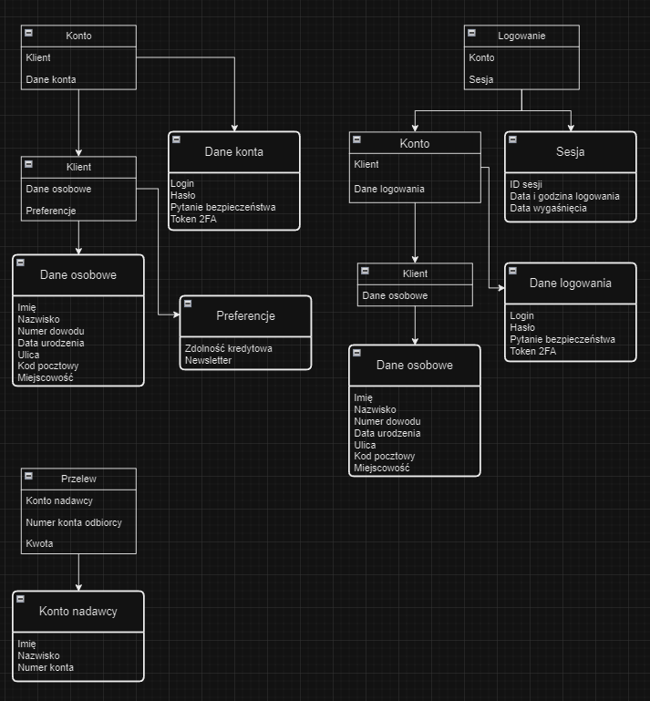

# Zadanie 1
## Opis
Zadanie polegało na zamodelowaniu kilku kontekstów modelu bankowego. W swoim modelu skupiłem się na kontekstach: Zarządzanie kontem, przelewy, uwierzytelnianie.

## Zdefiniowane konteksty, encje i agregacje
### Konteksty
1. Zarządzanie kontem
2. Przelewy
3. Uwierzytelnianie

### Agregacje
1. Konto
2. Przelew
3. Logowanie

### Encje
1. Klient (Konto)
2. Konto (Logowanie)
3. Klient (Logowanie)

### Obiekty wartości
1. Dane konta:
   * Login (alfanumeryczne, max 16 znakow)
   * Hasło (alfanumeryczne+specjalne)
   * Pytanie bezpieczeństwa (pytanie/separator/odpowiedz)
   * Token 2FA (alfanumeryczne+specjalne)
2. Dane osobowe
   * Imię (litery)
   * Nazwisko (litery)
   * Numer dowodu (3 litery + 6 cyfr)
   * Data urodzenia (data)
   * Ulica (alfanumeryczne)
   * Kod pocztowy (alfanumeryczne, max 8 znakow)
   * Miejscowość (litery)
3. Preferencje
   * Zdolność kredytowa (liczba)
   * Newsletter (tak/nie)
4. Sesja
   * ID sesji (alfanumeryczne)
   * Data i godzina logowania (data/godzina)
   * Data i godzina wygaśnięcia (data/godzina)
5. Konto nadawcy
   * Imię (litery)
   * Nazwisko (litery)
   * Numer konta (cyfry jako string)

